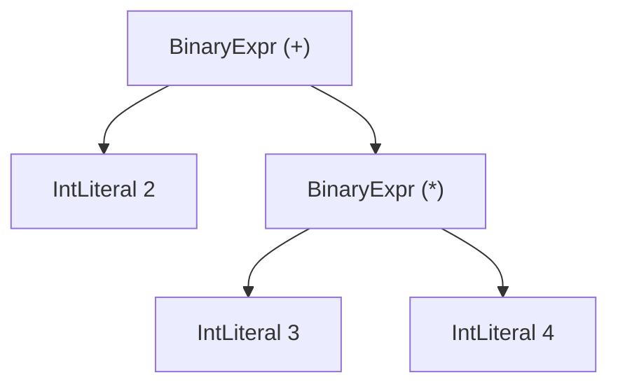
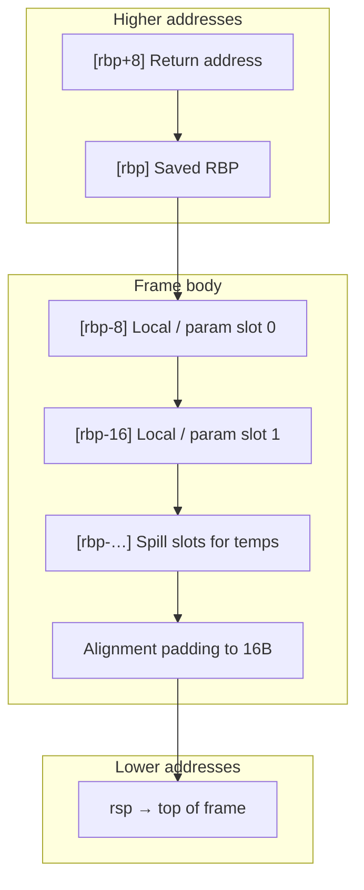

# miniC Compiler Architecture

**Version:** 1.0  
**Status:** Reference architecture for the miniC toolchain  
**Audience:** Compiler contributors, students, and advanced users

This document describes how the miniC compiler transforms source text into x86-64 NASM assembly: lexical analysis, parsing, semantic analysis, intermediate representation (IR), and code generation under the System V AMD64 ABI.

---

## Table of Contents

1. [Overview](#1-overview)
2. [Compilation Pipeline](#2-compilation-pipeline)
3. [Lexer](#3-lexer)
4. [Parser and AST](#4-parser-and-ast)
5. [Semantic Analyzer](#5-semantic-analyzer)
6. [Intermediate Representation (IR)](#6-intermediate-representation-ir)
7. [Code Generator](#7-code-generator)
8. [System V ABI and Calling Convention](#8-system-v-abi-and-calling-convention)
9. [Register Allocation](#9-register-allocation)
10. [Stack Frame Layout](#10-stack-frame-layout)
11. [Error Handling Model](#11-error-handling-model)
12. [Component Map](#12-component-map)
13. [Design Rationale](#13-design-rationale)

---

## 1. Overview

### 1.1 Role of the compiler

The `minic` driver (`src/main.cpp`) runs a **multi-pass** front end and a single back-end emission pass:

| Pass | Input | Output |
|------|-------|--------|
| Lexer | Source characters | Token stream |
| Parser | Tokens | Abstract Syntax Tree (AST) |
| Semantic Analyzer | AST | Typed AST + symbol tables (or errors) |
| IR Generator | Typed AST | Flat IR instruction list |
| Code Generator | IR | NASM text (`output.asm`) |

### 1.2 Design principles

| Principle | Implementation |
|-----------|----------------|
| Clear phases | Each stage owns one concern; no codegen during parse |
| Visitor pattern | AST traversal via `ASTVisitor` for semantic + IR |
| Explicit IR | SSA-*like* temps (`tN`), labels, jumps—easy to inspect |
| ABI honesty | Calls and frames match Linux System V |
| Debuggability | Human-readable tokens, AST dumps, IR dumps |

> **Note:** The compiler always writes **`output.asm`** in the current working directory when given a source file path.

---

## 2. Compilation Pipeline

### 2.1 End-to-end flow

```mermaid
flowchart LR
    SRC["Source<br/>.mc / .cmm"] --> LEX["Lexer"]
    LEX --> TOK["Token stream"]
    TOK --> PAR["Parser"]
    PAR --> AST["AST"]
    AST --> SEM["Semantic<br/>Analyzer"]
    SEM --> TAST["Typed AST"]
    TAST --> IRG["IR Generator"]
    IRG --> IR["IR Program"]
    IR --> CG["Code Generator"]
    CG --> ASM["output.asm<br/>NASM"]
    ASM --> NASM["nasm -f elf64"]
    NASM --> OBJ[".o"]
    OBJ --> LINK["gcc -no-pie"]
    LINK --> EXE["Executable"]
```



### 2.2 Pass contracts

| Stage | May fail? | On failure |
|-------|-----------|------------|
| Lexer | Yes (e.g. bad string) | Diagnostic; no further passes |
| Parser | Yes (syntax) | Diagnostic; empty / partial AST discarded |
| Semantic | Yes (types, scopes) | Errors collected; codegen skipped |
| IR / Codegen | Rarely | Assumes valid typed AST |

### 2.3 Linking model

Generated assembly is **not freestanding**:

- `global main` — C entry from libc CRT
- `extern printf` — used by builtin `print`
- Link with `gcc -no-pie output.o -o prog` (or equivalent)

---

## 3. Lexer

### 3.1 Responsibility

The lexer (`Lexer`) converts a character buffer into a sequence of `Token` values with:

- **Kind** (`TokenType`)
- **Lexeme** (optional string payload)
- **Source location** (line / column)

### 3.2 Classification algorithm

1. Skip whitespace (except tracking newlines).
2. Recognize comments (`//`, `/* */`) and discard them.
3. Match multi-character operators before single-character ones (`==`, `!=`, `<=`, `>=` before `=`, `!`, `<`, `>`).
4. Scan identifiers / keywords via a keyword table.
5. Scan integer and string literals with escape handling.

### 3.3 Token categories

| Category | Examples |
|----------|----------|
| Keywords | `int`, `while`, `break`, `continue`, … |
| Literals | `INT_LITERAL`, `STRING_LITERAL` |
| Identifiers | `IDENTIFIER` |
| Operators | `PLUS`, `STAR`, `AMP`, `EQ`, … |
| Delimiters | `LPAREN`, `LBRACE`, `SEMI`, `COMMA` |
| Meta | `NEWLINE`, `END` |

### 3.4 Pointer-related tokens

| Lexeme | Role in later phases |
|--------|----------------------|
| `*` | Multiply **or** dereference / pointer declarator |
| `&` | Address-of |

Disambiguation is **not** done in the lexer; the parser and semantic analyzer decide based on context.

---

## 4. Parser and AST

### 4.1 Parsing strategy

miniC uses a **hand-written recursive-descent** parser with operator-precedence layering for expressions (comparison → term → factor → unary → primary).

```text
parseProgram
  └─ parseFunction*
       └─ parseBlock → parseStatement*
            └─ parseExpression (precedence climb / layered calls)
```

### 4.2 Grammar highlights

| Construct | Parser entry |
|-----------|--------------|
| Functions | Return type + name + params + block |
| `int *` | Type `int` then optional `*` before name |
| Calls | Identifier followed by `(` → `CallExpr` |
| `&` / unary `*` | Unary production |
| `*p = e;` | Special statement (`DerefAssignStmt`) |
| `break` / `continue` | Keyword statements |

### 4.3 Abstract Syntax Tree

The AST is a typed C++ class hierarchy under `ASTNode`, with statement and expression branches (`Stmt`, `Expr`). Notable nodes:

| Node | Meaning |
|------|---------|
| `Program` | List of functions |
| `FunctionDecl` | Signature + body |
| `VarDecl` | Local declaration |
| `AssignStmt` / `DerefAssignStmt` | Stores |
| `IfStmt` / `WhileStmt` | Control |
| `BreakStmt` / `ContinueStmt` | Loop exits |
| `BinaryExpr` / `UnaryExpr` | Operators |
| `AddressOfExpr` / `DereferenceExpr` | Pointer ops |
| `CallExpr` | Function call |
| `IdentifierExpr` / literals | Leaves |

### 4.4 Example AST — expression `2 + 3 * 4`



This tree mirrors precedence: multiplication binds tighter, so `*` is the right child of `+`.

### 4.5 Visitor pattern

`ASTVisitor` defines `visit*` methods for each node. Semantic analysis and IR generation implement visitors (or accept-based walks) so new passes can be added without rewriting the tree.

---

## 5. Semantic Analyzer

### 5.1 Goals

1. Resolve names to declarations.
2. Enforce type rules (see [LanguageSpecification.md](./LanguageSpecification.md)).
3. Validate control-flow constraints (`break`/`continue` only in loops).
4. Register and type-check the builtin `print`.

### 5.2 Symbol tables

| Table | Keys | Values |
|-------|------|--------|
| Function table | Function name | Signature (return + params) |
| Scope stack | Variable name | Type + declaration binding |

Entering a block pushes a scope; leaving pops it. Shadowing is allowed across levels; redeclaration in the same level is not.

### 5.3 Type system (analyzer view)

| Enum / concept | Language type |
|----------------|---------------|
| `TYPE_INT` | `int` |
| `TYPE_STRING` | `string` |
| `TYPE_VOID` | `void` |
| `TYPE_PTR_INT` | `int *` |
| `TYPE_ERROR` | Poison / recovery |

### 5.4 Representative checks

| Construct | Check |
|-----------|-------|
| `a + b` | Both `int` → `int` |
| `p = &x` | `x` is `int` var; result `TYPE_PTR_INT` |
| `*p` | `p` is `TYPE_PTR_INT` → `int` |
| `foo(a,b)` | Arity + argument types match |
| `break` | `loop_depth_ > 0` |
| `print(e)` | `e` is `int` |

### 5.5 Builtin injection

At startup, the analyzer inserts:

```text
print : void (int)
```

into the global function table so user code may call it without defining it.

---

## 6. Intermediate Representation (IR)

### 6.1 Purpose

IR flattens nested expressions into a linear instruction sequence with:

- **Temps** `t0`, `t1`, … for expression results
- **Labels** for branches and loops
- **Explicit control** (`JUMP`, `JUMP_IF_FALSE`, …)
- **Memory ops** for locals and pointer traffic

### 6.2 Instruction catalogue (conceptual)

| Op | Meaning |
|----|---------|
| `MOV` / load const | Place value in temp |
| `ADD` `SUB` `MUL` `DIV` | Arithmetic on temps |
| `CMP_*` | Comparisons → 0/1 |
| `ADDR` | Address of local → temp |
| `LOAD` | `*addr` → temp |
| `STORE` | temp → `*addr` or local |
| `CALL` | Call with arg temps |
| `LABEL` | Branch target |
| `JUMP` / conditional jump | Control transfer |
| `RET` | Return |

### 6.3 Control-flow lowering

**`while (cond) body`:**

```text
L_cond:
  t = eval(cond)
  JUMP_IF_FALSE t, L_end
  body
  JUMP L_cond
L_end:
```

**`break` / `continue`:** use a **loop stack** of `(L_cond, L_end)` pairs; emit `JUMP` to `L_end` or `L_cond`.

### 6.4 Call lowering

```text
t_args... = evaluate arguments
CALL callee, t_args → t_result   (or void)
```

Argument order is preserved for ABI mapping in codegen.

### 6.5 Why IR helps

| Benefit | Detail |
|---------|--------|
| Simpler codegen | One IR insn ≈ few asm lines |
| Easier testing | Assert on IR ops without NASM |
| Future opts | Room for constant folding / DCE |

---

## 7. Code Generator

### 7.1 Input / output

- **Input:** IR for each function  
- **Output:** NASM64 assembly with `.text`, literals (e.g. `fmt_int`), and prologue/epilogue per function

### 7.2 Emission outline

1. Emit file header (`bits 64`, `default rel`, `global main`, `extern printf`).
2. For each function:
   - Compute stack frame size (locals + spills + alignment).
   - Emit prologue.
   - Translate IR instructions sequentially.
   - Emit epilogue / `ret`.
3. Emit read-only format string for `print`.

### 7.3 Builtin `print`

IR `CALL print` is special-cased or emitted as:

```nasm
mov rdi, fmt_int
mov rsi, <value>
xor eax, eax
call printf
```

---

## 8. System V ABI and Calling Convention

### 8.1 Argument registers

| Order | Register |
|-------|----------|
| 1st | `rdi` |
| 2nd | `rsi` |
| 3rd | `rdx` |
| 4th | `rcx` |
| 5th | `r8` |
| 6th | `r9` |
| 7+ | Stack (right-to-left push order as required) |

### 8.2 Return and callee-saved

| Item | Convention |
|------|------------|
| Integer / pointer return | `rax` |
| Frame pointer | `rbp` maintained |
| Callee-saved (if used) | Must restore (`rbx`, `r12`–`r15`, …) |

### 8.3 Stack alignment

Before `call`, `rsp` must be **16-byte aligned**. The code generator adjusts the frame size (`sub rsp, N`) so that alignment holds at call sites (accounting for the return address pushed by `call`).

### 8.4 Calls and caller-saved registers

Temps cached in caller-saved registers (`r10`–`r15`, etc.) are treated as **live across calls** carefully: values that must survive a `CALL` are spilled to the stack before the call (see §9).

---

## 9. Register Allocation

### 9.1 Strategy overview

miniC uses a **lightweight register pool**, not a full graph-coloring allocator:

| Class | Storage |
|-------|---------|
| User variables | Always stack slots relative to `rbp` |
| IR temps `tN` | Prefer registers `r10`–`r15`; spill when needed |

### 9.2 Pool behavior

1. Allocate a free register from the pool for a temp.
2. On pool exhaustion → **spill** a temp to a dedicated stack slot.
3. On `CALL` → **must-spill** (or invalidate) temps held in caller-saved regs that remain live.

### 9.3 Trade-offs

| Pros | Cons |
|------|------|
| Simple, predictable | Suboptimal vs graph coloring |
| Good for teaching ABI | More memory traffic under pressure |
| Easy to debug | Fixed small pool |

---

## 10. Stack Frame Layout

### 10.1 Conceptual layout

Addresses decrease as the stack grows downward. After prologue:

```text
high addresses
┌─────────────────────────────┐
│  return address             │  ← pushed by call
├─────────────────────────────┤
│  saved rbp                  │  ← push rbp; mov rbp, rsp
├─────────────────────────────┤
│  local slots / spills       │  ← sub rsp, frame_size
│  (growing toward lower)     │
│  …                          │
│  outgoing args (if any)     │
└─────────────────────────────┘
low addresses                  ← rsp
```

### 10.2 Mermaid schematic



### 10.3 Access patterns

| Kind | Typical addressing |
|------|--------------------|
| Local `x` | `qword [rbp - offset_x]` |
| Parameter `i` (≤6) | Copied to a local slot in prologue, or read from incoming regs then stored |
| Spilled temp | Dedicated negative offset from `rbp` |
| `&x` | `lea rax, [rbp - offset_x]` (then moved to temp/reg) |

### 10.4 Prologue / epilogue pattern

```nasm
push rbp
mov  rbp, rsp
sub  rsp, <frame_size>
; … body …
leave          ; or mov rsp, rbp ; pop rbp
ret
```

---

## 11. Error Handling Model

| Phase | Style |
|-------|-------|
| Lexer | Fail fast on malformed literals |
| Parser | Syntax error with location; stop or panic-mode depending on path |
| Semantic | Collect multiple diagnostics when practical |
| Codegen | Assumes IR is well-formed |

Diagnostics should include **line/column** when available so editors and E2E tooling can point at the fault.

---

## 12. Component Map

| Source area | Role |
|-------------|------|
| `src/Lexer.*` | Tokenization |
| `src/Parser.*` | Recursive descent → AST |
| `src/AST*` | Node types + visitor |
| `src/SemanticAnalyzer.*` | Types, scopes, builtins |
| `src/IR*` / `IRGenerator` | Flattening to IR |
| `src/CodeGenerator.*` | NASM emission, ABI, regs |
| `src/main.cpp` | Driver CLI |
| `tests/` | Google Test unit suite |
| `e2e_tests/` | Assemble + link + compare stdout |

---

## 13. Design Rationale

### 13.1 Why not LLVM IR?

miniC emits a **custom IR** and handwritten NASM to keep the learning surface small and the repository self-contained. Mapping to LLVM remains a possible future backend.

### 13.2 Why stack-heavy locals?

Placing user variables on the stack simplifies `&variable` and avoids aliasing complexity in a teaching compiler. Temps still enjoy a register pool for expression density.

### 13.3 Why libc `main` / `printf`?

Linking against libc yields portable I/O and a standard process entry, which matches how students run binaries on Linux and in Docker-based E2E tests.

---

## See also

- [Language Specification](./LanguageSpecification.md) — normative language rules  
- [Development Guide](./DevelopmentGuide.md) — build, test, contribute  
- [Documentation Home](./README.md)
