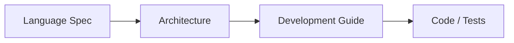

# miniC Documentation

Official documentation for the **miniC** compiler — a C-like language toolchain targeting Linux x86-64 (NASM + libc).

---

## Start here

| Document | Description |
|----------|-------------|
| **[Language Specification](./LanguageSpecification.md)** | Normative language rules: types, operators, control flow, pointers, scoping, builtin `print` |
| **[Compiler Architecture](./CompilerArchitecture.md)** | Pipeline design: Lexer → Parser → Semantic → IR → Codegen, ABI, registers, stack frames |
| **[Development Guide](./DevelopmentGuide.md)** | Build, test, format, Doxygen, contribution checklist |

---

## Reading order

1. Learn what programs are valid (**Language Spec**).
2. Learn how the compiler implements that (**Architecture**).
3. Build and verify changes (**Development Guide** + `tests/`, `e2e_tests/`).

---

## Quick links (repository)

| Resource | Path |
|----------|------|
| Project README | [../README.md](../README.md) |
| E2E tests | [../e2e_tests/README.md](../e2e_tests/README.md) |
| Public headers | [../include/minic/](../include/minic/) |
| Compiler sources | [../src/](../src/) |

---

## Document status

| Doc | Status |
|-----|--------|
| Language Specification | Stable v1.0 |
| Compiler Architecture | Stable v1.0 |
| Development Guide | Stable v1.0 |

Older per-component stubs (`Lexer.md`, `Parser.md`, …) have been **merged** into the architecture and language documents above.
